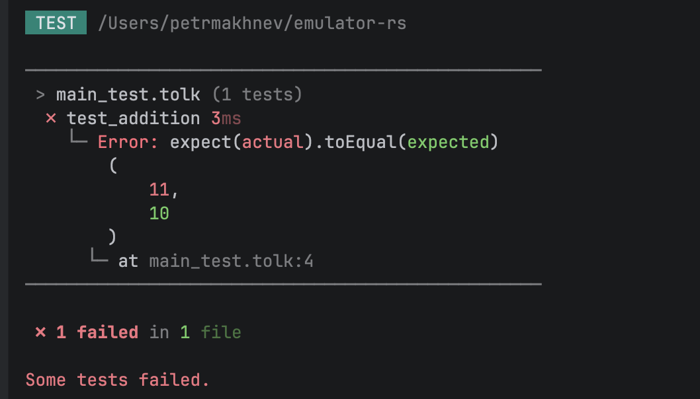

Это обычный jetton контракт, в нем самом нет ничего необычного, необычное начинается когда вы заглянете в папку тестов. Мы привыкли писать тесты на TypeScript, но что если?

Что если мы будем писать тесты... на Толке?

Подожди подожди, какие еще тесты на Толке??? Он не знает ничего о файловой системе, о компиляции, не говоря уже про **эмуляцию сообщений**. И вы абсолютно правы! Но что нам мешает добавить это!

Чтобы понять как решить эту проблему, нужно решить другую проблему, фундаментальную проблему.

Как вызывать из Толка **внешний** код? Если мы сможем вызывать внешний код написанный на другом языке, например, на Расте, то что в мире может помешать нам реализовать, например, чтение файла?

Ничего!

Ник придумал простую, но гениальную идею, что если добавить инструкцию, которая будет принимать весь стек, вызывать функцию, зарегистрированную по ID, и отдавать обратно измененный стек. Тогда все что нужно, это во внешнем коде эмулятора вызвать функцию регистрации кода для нужного ID и вот мы вызываем внешний код из Толка!

Теперь, имея такое элегантное решение, мы можем все. Или нет? Нет, но вообще-то да! :)


Здесь я устал придумывать хороший текст, дальше просто описание. О преимуществах тестов на Толке поговорим как-нибудь в следующий раз.

Осталось только собрать все воедино и написать рантайм который смог бы делать нужные нам для тестов вещи, например, отправлять сообщения с одного контракта на другой. Эта часть пока что не открыта, так как еще очень сырая!

Давайте поговорим лучше о том что из-за себя представляют тесты на Толке.

Высокоуровнево — тесты это просто файлы на Толке с окончанием `_test`, например, `wallet_test.tolk`.
Каждый тест это get-метод с именем начинающимся с `test`, например, `test_mint`.

Простейший тест будет выглядеть так:

```tolk
get fun test_addition() {
    expect(5 + 5).toEqual(10)
}
```

А благодаря великолепной системе типов Толка мы получаем синтаксис проверок один в один как на TypeScript, при этом в Толке его гораздо проще расширять:

```tolk
fun Expectation<int>.toBeTen(self) {
    expect(self.value).toEqual(10)
}

get fun test_addition() {
    expect(5 + 5).toBeTen()
}
```

Вуаля!

Также `expect()` достаточно умны, чтобы знать где они объявлены, чтобы отображать конкретное место падения:



С юнит тестами на самом деле все довольно очевидно и просто, у `expect()` куча методов на все случаи жизни. Импортируешь в файл тестов нужный файл с функциями и пишешь нужные тесты.

Давайте поговорим про то зачем мы тут сегодня собрались, про реальные тесты!

```tolk
fun setup_test(): (Network, JettonMinter, Treasury, Treasury) {
    val net = accuireNet("net");

    val deployer = net.treasury("deployer");
    val not_deployer = net.treasury("not_deployer");

    val minter = JettonMinter.fromStorage(MinterStorage {
        totalSupply: 1000000,
        adminAddress: deployer.address,
        content: createEmptyCell(),
        jettonWalletCode: build("Wallet", "./.jetton/contracts/jetton-wallet-contract.tolk"),
    });

    val transactions = minter.sendDeploy(net, { value: ton("10") });
    expect(transactions).toHaveSuccesfulDeploy({ to: minter.address });

    return (net, minter, deployer, not_deployer);
}
```

Этот кусочек кода описывает то что обычно пишется в `beforeAll()/beforeEach()`. Мы создаем деплоеров, создаем минтера, с которым будем работать, деплоим его, проверяем что он реально задеплоился и возвращаем данные которые будем использовать в тестах.

Пока у нас нет ABI, и для Толк тестов нужно писать врапперы, например, вот так выглядит создание Minter:

```tolk
fun JettonMinter.fromStorage(storage: MinterStorage) {
    val init = ContractState {
        code: build("Minter", "./.jetton/contracts/jetton-minter-contract.tolk"),
        data: storage.toCell(),
    };
    val addr = address.fromValidBuilder(AutoDeployAddress { stateInit: init }.buildAddress());
    return JettonMinter {
        address: addr, init
    }
}
```

Но вы вероятно и так захотите их написать, чтобы не было дублирующегося кода, поэтому не думаю что это сильно неудобно.

Сами тесты не отличаются чем-то необычным, вот, например, простой тест минта:

```tolk
get fun `test-can-mint`() {
    val (net, minter, deployer, _) = setup_test();
    val initial_total_supply = minter.getTotalSupply(net);

    val wallet = userWallet(minter, net, deployer.address);

    val initial_jetton_balance = ton("1000.23");
    val mint_result = minter.sendMint(
        net,
        deployer.address,
        deployer.address,
        initial_jetton_balance,
        ton("0.05"),
        ton("1")
    );
    expect(mint_result).toHaveSuccesfulTx({ from: minter.address, to: wallet.address });
    expect(mint_result).toHaveSuccesfulTx({ from: wallet.address, to: minter.address }, 65535);
    expect(wallet.getJettonBalance(net)).toEqual(initial_jetton_balance);
    expect(minter.getTotalSupply(net)).toEqual(initial_total_supply + initial_jetton_balance)
}
```

А вот как выглядит отправка этого самого минта:

```tolk
fun JettonMinter.sendMint(self, net: Network, from: address, recipient: address, jetton_amount: int, forward_ton_amount: int, total_ton_amount: int) {
    val msg = createMessage({
        bounce: false,
        value: total_ton_amount + ton("0.015"),
        dest: self.address,
        body: MintNewJettons {
            queryId: 0,
            mintRecipient: recipient,
            tonAmount: total_ton_amount,
            internalTransferMsg: InternalTransferStep {
                queryId: 0,
                jettonAmount: jetton_amount,
                transferInitiator: createAddressNone(),
                sendExcessesTo: self.address,
                forwardTonAmount: forward_ton_amount,
                forwardPayload: createEmptySlice(),
            }.toCell(),
        },
    });
    return net.send(from, msg, SEND_MODE_PAY_FEES_SEPARATELY)
}
```

После TypeScript тестов, этот код должен быть как родной. Учитывайте, это не финальное API, пока что скорее наброски, чтобы понять, а как можно.

В целом все тесты в [wallet_test.tolk](tests/wallet_test.tolk) должны читаться так же просто как и на TypeScript,
